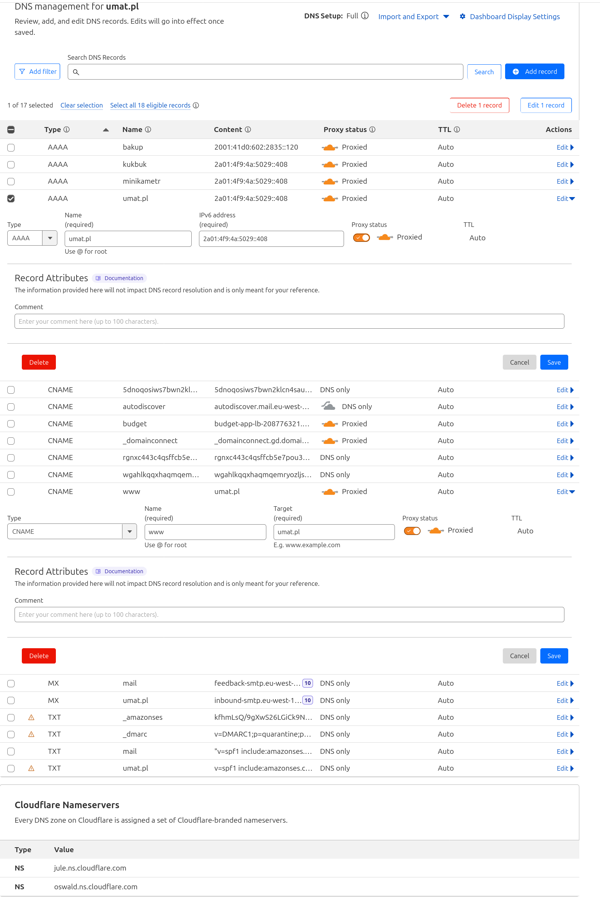

# Nginx Reverse Proxy for Multiple Applications
This repository contains a configuration for an Nginx reverse proxy that allows you to host multiple applications on the same VPS server. 
To run the nginx server, you need to have Docker and Docker Compose installed on your VPS.
```
docker compose up -d
```

# Backup commands (for nginx)

Stop nginx
```
sudo systemctl stop nginx
```
Start nginx
```
sudo systemctl start nginx
```

Kill vscode-server processes
```
pkill -f vscode-server
```

# Adding new application
* Add new application to `nginx/sites-enabled`
* Configure the DNS record on CloudFlare
Example can be seen in the image below:

* Get certbot certificate. Guide on https://certbot.eff.org/instructions
* First copy the appropriate nginx configuration file from `nginx/sites-enabled` to `/etc/nginx/sites-enabled/` because that's where certbot will look for it.
```
cp nginx/sites-enabled/<app_config> /etc/nginx/sites-enabled/
```
* Then run the certbot command:
```
sudo certbot --nginx
```
Select the domain you want to get the certificate for and press enter. Certbot will automatically configure the nginx configuration file for you. Copy the file back to `nginx/sites-enabled` and remove the one from `/etc/nginx/sites-enabled/`. Commit the changes to the repository.
```
cp /etc/nginx/sites-enabled/<app_config> nginx/sites-enabled/
```
Certbot will atttempt to use the system nginx process that's why the docker-compose nginx process needs to be stopped temporarily.

The docker has to also be stopped temporarily to allow certbot to refresh the certificates. 
To do this, update the cron entry 
```bash
# location of the file: /etc/cron.d/certbot
0 0 1 * * root test -x /usr/bin/certbot -a \! -d /run/systemd/system && perl -e 'sleep int(rand(43200))' && certbot -q renew --pre-hook "docker stop nginx" --post-hook "killall nginx && docker compose -f /home/p-tutorials/mikrus/docker-compose.yml up -d"
```
